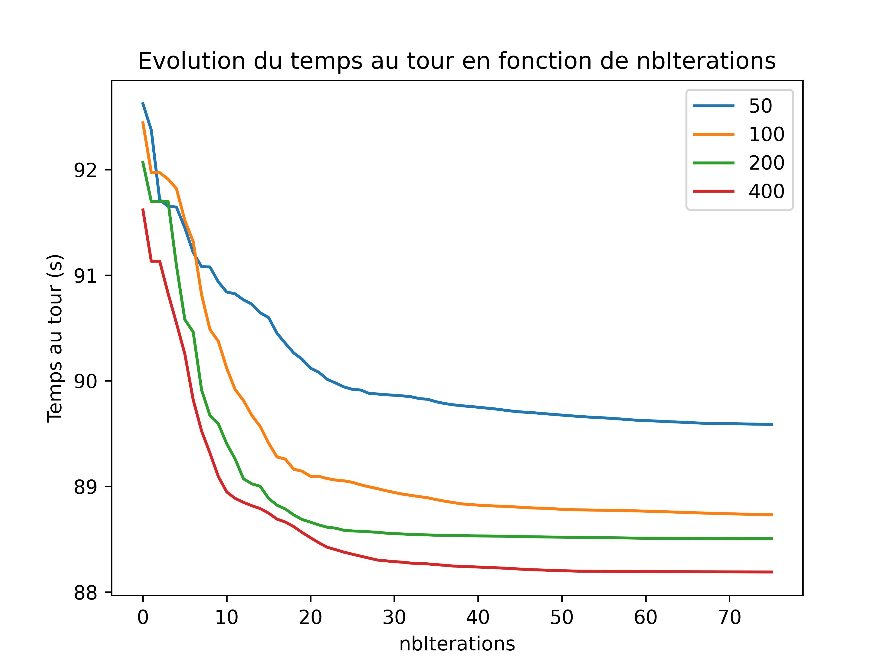
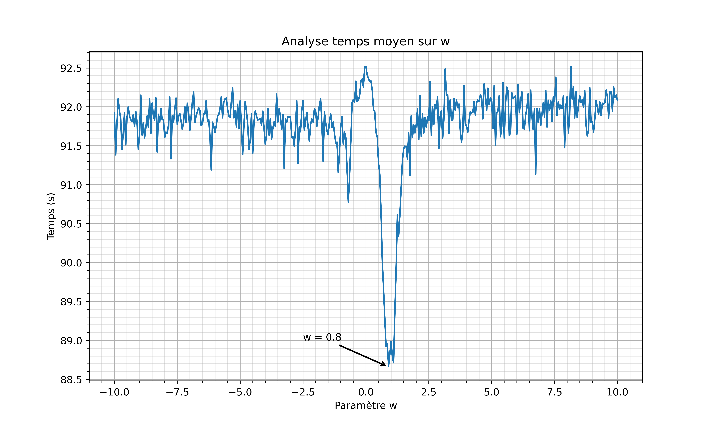
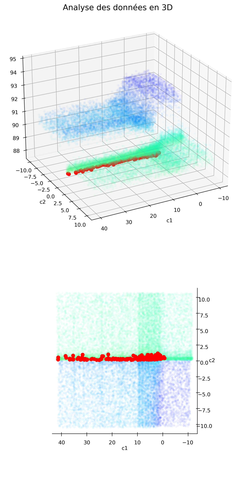
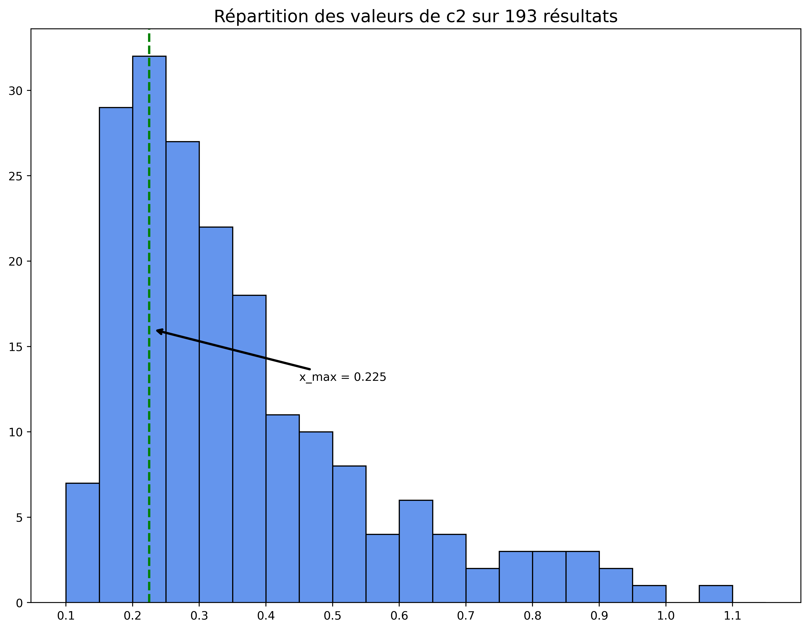
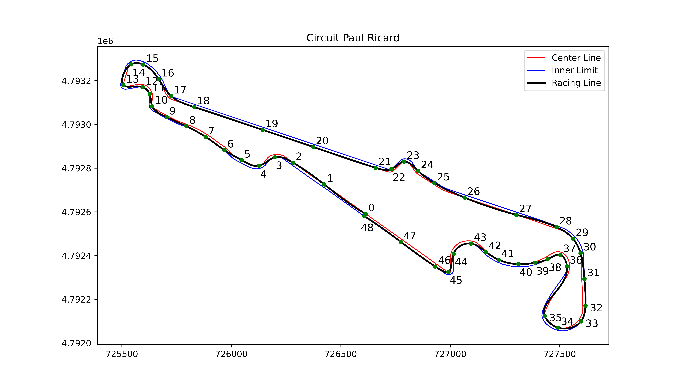

# TIPE
This is the repo for my TIPE project. On the theme "Sport and games".

So i decided to work on the optimization of the racing-line of a car on a track. And choose the PSO algorithm to do so. But in the papers on the subject, the authors never really explain how to find the ideal parameters for the PSO algorithm. So i decided to work on this subject.

Question : How to find the ideal parameters for the PSO algorithm to optimize the trajectory of a car on a track ?

Response :
For the French GP track, Paul Ricard, the ideal parameters are :
- `n_particles = 50`
- `n_iterations = 150`
- `w = 0.8`
- `c1 = 1`
- `c2 = 0.225`

## Installation

You will need Python 3, and to download new track check the repository [here](https://github.com/bacinger/f1-circuits).

### Dependencies

`pip install numpy geopandas matplotlib shapely scipy pyproj tqdm`

## Usage

To generate trajectory, run `python3 -B -u tipe.py`

## TODO

- [] Finish, correct my algorithm to place sectors on any track
- [] Adapt the program to work with any track
- [] Clean the code :)

## My research

You can find my powerpoint presentation in the repo. It's in French, but you can still look at the images and the graphs as there is not so much text.

### The Track

The track is the Paul Ricard track, in France. It's a track that is used for the French GP and as a french person i choose this one. Here's the track with the sectors i placed on it.

### Analysis of the parameters

Firstly for the influence of the number of particles on the convergence of the algorithm and the number of iteration, we can see that the more particles we have, the faster the algorithm converges. But after a certain number of particles, the algorithm doesn't converge faster. Here's the graph of the convergence of the algorithm with the number of particles. Thus, we can see that the number of particles doesn't really matter after 50 particles.

Now let's focus on the parameters inside of the velocity update formula :
$$ v(t+1) = w * v(t) + c1 * r1 * (pbest - x(t)) + c2 * r2 * (gbest - x(t)) $$

We can see that the inertia weight `w` has a big influence on the convergence of the algorithm. The best value for `w` is 0.8. 

For the following parameters, i used the dual annealing algorithm to find the best value for the parameters implemented by scipy.

The cognitive parameter `c1` has a big influence on the convergence of the algorithm too. It needs to be strictly positive so `1` is ok. 

The social parameter `c2` has a big influence on the convergence of the algorithm too. The best value for `c2` is 0.225. 

So that's it for the parameters. With those i generated this racing line for exemple :

I hope you enjoyed my research. If you have any question, feel free to ask me.

## License
This project is under the MIT license. See [LICENSE](https://github.com/Xayon98/TIPE/LICENCE) for more information.

